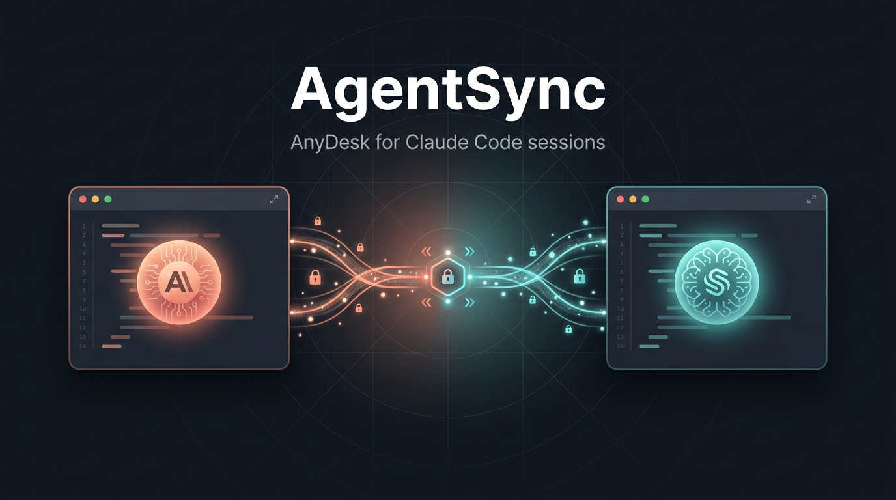

<div align="center">



# AgentSync

**AnyDesk for Claude Code sessions.**

Connect any two Claude Code sessions — on the same machine or across the internet —
with a one-tap consent handshake, then let them ask each other questions and pass
information back and forth. A human stays in the loop the whole time: accept, pause,
resume, or stop at any moment.

[Status](#status) · [How it works](#how-it-works) · [Quickstart](#quickstart) · [Security](#security-model) · [Roadmap](#roadmap)

</div>

---

> ⚠️ **Status: early / work in progress (v0.1, alpha).** The architecture below is the
> target design. Not all of it is built yet — see [Status](#status).

## What is AgentSync?

Tools like AnyDesk and TeamViewer let two people share a screen: one side requests a
connection, the other side **accepts a consent prompt**, and then they interact — and
crucially, **both ends only dial *outbound*** to a rendezvous server, so it works
through NAT, firewalls, and VPNs without any port-forwarding.

AgentSync brings that exact model to **Claude Code sessions**:

- One Claude Code session (or its human) asks to connect to another by its short **AgentSync ID**.
- The other side sees a **TUI consent screen** and accepts (or rejects, or "always allow").
- Once connected, either session can **ask the other anything** (`agentsync_ask`), send
  messages, and stream replies — bidirectionally, as a back-and-forth conversation
  between two AI coding agents.
- A human can **pause / resume / stop / disconnect** the bridge at any time.

It works **locally** (two Claude sessions on the same PC) and **remotely** (two sessions
on different machines, even across a VPN) — through one transport abstraction.

## Why?

A single Claude Code session only knows its own repo. Real work often spans several
repos, machines, and contexts at once. AgentSync lets specialized sessions cooperate:
a *frontend* session asks a *backend* session for an API contract; a *marketplace* repo
asks a *machine-controller* repo to confirm a file format; an on-prem GPU box's session
answers questions from your laptop's session — all with explicit human consent and
control, and without copy-pasting between terminals.

## How it works

```
   ┌─ Machine A (your laptop) ─────────────┐              ┌─ Machine B (GPU box, behind VPN) ─┐
   │                                        │              │                                    │
   │  Claude session  ──┐                   │              │              ┌──  Claude session   │
   │  Claude session  ──┤  Unix socket      │              │   Unix socket├──  Claude session   │
   │       (plugin/MCP) │                   │              │              │      (plugin/MCP)    │
   │                  ┌─▼──────────┐        │              │       ┌──────▼─────┐                │
   │                  │  agentsync │  outbound wss          outbound wss  agentsync │            │
   │                  │   daemon   │ ───────────────►  ◄─────────────── │   daemon  │            │
   │                  │ (local hub)│        │   ┌──────────────────┐   │(local hub) │            │
   │                  └────────────┘        │   │  agentsync-relay │   └────────────┘            │
   │   local↔local routed here, no network  │   │ (rendezvous,     │                            │
   └────────────────────────────────────────┘   │  E2E-encrypted)  │ ──────────────────────────┘
                                                 └──────────────────┘
              local ↔ local : stays inside the daemon (instant, no relay)
              local ↔ remote: daemon → relay → remote daemon
```

Three pieces, one repo:

| Component | What it is |
|---|---|
| **`agentsync` daemon** | Runs once per machine. Acts as the **local hub** (Claude sessions connect to it over a Unix-domain socket) **and** the **relay gateway** (keeps one outbound WebSocket to the relay). Routes by peer: local target → deliver over the socket; remote target → forward via the relay. Owns connection/consent state and pause/stop. |
| **`agentsync` TUI** | The AnyDesk-style face: shows this machine's ID, pops the **consent prompt** on incoming connections, shows the live cross-session transcript, and exposes **[P]ause / [R]esume / [S]top / Disconnect**. |
| **`agentsync` Claude Code plugin** | What a Claude session loads. An **MCP server** gives the model tools (`agentsync_peers`, `agentsync_connect`, `agentsync_ask`, `agentsync_send`, `agentsync_inbox`, `agentsync_status`); **hooks** register the session on start and surface incoming messages; **slash commands** (`/agentsync-ask`, `/agentsync-peers`) drive it by hand. |
| **`agentsync-relay`** | A small, self-hostable WebSocket rendezvous server. Both peers dial out to it (NAT/VPN-proof). It only **routes** — payloads are end-to-end encrypted, so the relay never sees plaintext. |

### Core concepts

- **Node** — one machine running the daemon. Has a stable AgentSync ID like `AS-7K3F-9210`.
- **Session** — one Claude Code session connected to a node's daemon. Addressed by node ID
  (+ a session label such as its repo/cwd when a node hosts several).
- **Peer** — the session you're connected to. `agentsync_peers()` lists both the other
  Claude sessions on **your own machine** and the **remote** ones you've paired with.
- **Consent** — no traffic flows until the receiving side accepts. Remote connections
  always prompt; local same-user connections can default to auto-accept (configurable).

## Connection flow

**Remote (two machines):**
1. Both run `agentsync up` — each prints its ID and connects out to the relay.
2. On A, the Claude session calls `agentsync_connect("AS-…-B")` (or you run `agentsync connect AS-…-B`).
3. B's TUI shows: *"`marketplace` on AS-…-A wants to connect — [A]ccept / [R]eject / [Always allow]"*.
4. On accept, an encrypted session opens. Now `agentsync_ask` / messages flow both ways.
5. Either side can **pause / resume / stop** from the TUI; the bridge tears down cleanly.

**Local (same PC):** no relay and no `agentsync up` — just install the plugin in each
session. The daemon auto-starts and routes the two sessions to each other directly over
the Unix socket, and local peers auto-accept by default (no consent prompt).

## Quickstart

> Alpha (v0.1) — see [Status](#status).

**Local (same machine) — just install the plugin.** Inside Claude Code:

```text
/plugin marketplace add hemangjoshi37a/AgentSync
/plugin install agentsync@agentsync-marketplace
```

That's the entire setup. On session start the plugin **auto-starts a small background
daemon** (pure standard library — no `pip install`, no `agentsync up`), so any two Claude
Code sessions on this machine can immediately reach each other. Just ask your session to
use the `agentsync_*` tools (or `/agentsync-peers`, `/agentsync-ask <id> <question>`).
**No `pip install` needed** — the plugin is pure Python standard library and only
requires `python3`, which Claude Code already has.

**Remote (different machines)** needs a relay both can dial out to (AnyDesk-style). Install
the CLI from source (for the relay + optional auto-responder), run a relay, and point each
node at it:

```bash
git clone https://github.com/hemangjoshi37a/AgentSync.git && cd AgentSync && pipx install .
agentsync-relay                              # on a host both machines can reach (:8787)
agentsync set-relay wss://your-relay:8787    # on each node
```

Then, inside any Claude Code session, just ask it to *"connect to AS-…-B and ask them
which file format their service expects"* — it uses the `agentsync_*` tools, the other
side consents (once, or permanently via `agentsync trust <id>`), and the two agents talk.

## Usage

With the plugin installed, **just talk to your Claude Code session in plain language** —
*"list my AgentSync peers"*, *"ask `AS-7K3F-9210` which API version they're on"*,
*"send the build plan to `s2` and CC `s3`"*. Claude picks the right `agentsync_*` tool.
There are also slash commands and a CLI for doing things by hand.

**Slash commands (inside a session):**

| Command | What it does |
|---|---|
| `/agentsync-peers` | List the sessions you can reach (local + remote). |
| `/agentsync-connect <peer-id>` | Connect to a peer (remote peers must consent). |
| `/agentsync-ask <peer-id> <question>` | Ask a peer and report its answer. |

**Tools the model can call:**

| Tool | Purpose |
|---|---|
| `agentsync_whoami` | Your node id, session id, label. |
| `agentsync_peers` | List connectable peers. |
| `agentsync_connect(peer_id)` | Open a bridge to a peer (consent for remote). |
| `agentsync_ask(peer, prompt)` | Ask one peer — **or a list of peers** — and get the answer(s). |
| `agentsync_send(to, body, cc, bcc)` | Selective message, email-style **To/CC/BCC** — only addressed sessions receive it. |
| `agentsync_broadcast(body)` | Message every connected peer. |
| `agentsync_inbox()` | Read questions/messages others sent you. |
| `agentsync_respond(request_id, answer)` | Answer a question from your inbox. |
| `agentsync_control(peer, action)` | `pause` / `resume` / `stop` a bridge. |

**Addressing:** local peers (other sessions on this machine) are addressed by **session id**
(`s1`, `s2`, …) and auto-accept; remote peers are addressed by **node id** (`AS-XXXX-XXXX`)
and need consent once (or `agentsync trust` to make it permanent).

**CLI** (available when installed from source — `pipx install .`):

```bash
agentsync up               # open the TUI console (the daemon auto-starts regardless)
agentsync id               # your node id, label, relay, daemon status
agentsync peers            # list peers
agentsync connect <id>     # connect to a peer
agentsync trust <id>       # permanently auto-accept a peer (untrust to revoke; --all for everyone)
agentsync set-relay <url>  # set the relay used for remote connections
agentsync stop             # stop the daemon
```

**Status line (optional).** Show your AgentSync node id + connected machines permanently in
the Claude Code status bar — run `/agentsync-statusline` inside a session (or
`agentsync statusline-install` from the CLI; it preserves any status line you already have).
It renders like `🔗 AS-7K3F-9210 · 2 local · ↔ gpu-box`. The node id is your machine's
shareable address — another machine connects to you with `agentsync_connect("AS-7K3F-9210")`.

**Example — two sessions on one machine (zero setup):**
1. Open two Claude Code sessions (both have the plugin, so both auto-register).
2. In session A: *"use `agentsync_peers`, then ask the other session to summarize the file it's editing."*
3. A calls `agentsync_peers` (sees session B), then `agentsync_ask(<B's session id>, …)`; B answers; A relays the reply. No relay, no manual daemon.

**Unattended answering (optional):** to let a node answer peers automatically with no human
present, run the headless responder — it runs a locked-down, read-only Claude
(read [docs/security.md](docs/security.md) first):

```bash
agentsync-responder
```

## Security model

A mesh where one agent can query another — and potentially trigger a headless Claude on
the other machine — is powerful and must be treated as a real attack surface.

- **Consent-gated.** Nothing connects without the receiver accepting. Optional per-node
  connection password / pre-shared key.
- **Persistent trust (opt-in).** Accept a peer once with **"Always allow"** (or
  `agentsync trust <id>`) and it's saved to `trusted_nodes` in your config — that peer
  then auto-accepts across sessions and restarts, so a connection you permanently want
  never re-prompts. `agentsync untrust <id>` revokes it; `agentsync trust --all` (use with
  care) accepts every peer.
- **End-to-end encrypted.** Peers exchange keys on consent (PyNaCl); the relay only sees
  ciphertext and routing metadata.
- **Untrusted input.** All peer messages are treated as untrusted (prompt-injection
  aware). Incoming `ask`s answered by a headless responder run with a **tool allowlist**
  and a restrictive permission mode; destructive actions are denied by default and can
  require explicit per-query approval in the TUI.
- **Always interruptible.** Pause/stop/disconnect are instant and human-controlled.
- **No secrets in the repo.** Identities/keys live under `~/.agentsync/` (git-ignored).

## Status

| Area | State |
|---|---|
| Architecture & design | ✅ done |
| Core protocol + E2E crypto (PyNaCl) | ✅ done |
| Relay rendezvous server | ✅ done · tested |
| Node daemon (local hub + relay gateway) | ✅ done · tested |
| TUI (consent + pause/resume/stop) | ✅ done |
| CLI (`agentsync up / peers / connect / set-relay / stop`) | ✅ done |
| Claude Code plugin (MCP tools + hooks + slash commands) | ✅ done |
| Headless responder + security policy | ✅ done |
| Plugin marketplace manifest | ✅ done |
| Zero-setup install (plugin auto-starts a stdlib daemon — no `pip install`) | ✅ done |
| Persistent trusted-peer consent (`agentsync trust`) | ✅ done |
| Battle-tested — stress suite + real Claude Code sessions (auto-start + 2-way comms) | ✅ passing |
| Published to GitHub | ✅ live |
| Published to PyPI | ⏳ pending |

## Roadmap

- **v0.1** — local↔local and local↔remote messaging + `ask`/reply, consent, pause/stop.
- **v0.2** — headless auto-responder with approval policies; multiple concurrent peers.
- **v0.3** — group/broadcast rooms; richer TUI (transcript history, per-peer policies).
- **v0.4** — hosted public relay (opt-in), direct P2P with relay fallback (ICE-style).
- **Later** — capability/identity directory, audit logs, signed messages.

## Contributing

AgentSync is MIT-licensed and built in the open. Issues, ideas, and PRs welcome.
This is early — the protocol and APIs will change.

## License

[MIT](./LICENSE) © 2026 Hemang Joshi
